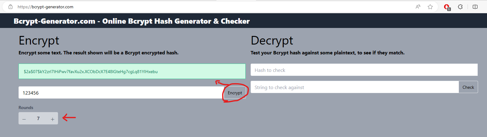

# bandesal-web-test
Prueba práctica

## Esquema de base de datos:

```sql
create table bandesal.readers (
    id integer primary key generated always as identity,
    name varchar(100) not null
);

create table bandesal.blogs (
    id integer primary key generated always as identity,
    tittle varchar(100) not null,
    description varchar(255)
);

create table bandesal.blogs_readers (
    r_id int references readers(id),
    b_id int references blogs(id)
);

create table bandesal.users (
    id integer primary key generated always as identity,
    username varchar(25) NOT NULL,
    password varchar(100) NOT NULL,
);
```
> [!NOTE]
> Se utilizó PostgreSQL como motor de base de datos.

> [!NOTE]
> Para crear un nuevo usuario se utiliza la web siguiente: ***/bandesal-web/pages/singup.xhtml***

> [!TIP]
> Se puede crear un nuevo usuario haciendo un insert directo a la tabla bandesal.users pero se debe encriptar el password. para esto usar la siguiente url: https://bcrypt-generator.com/ seteando en el parametro *rounds* el valor de 7. -> adjunto captura:


